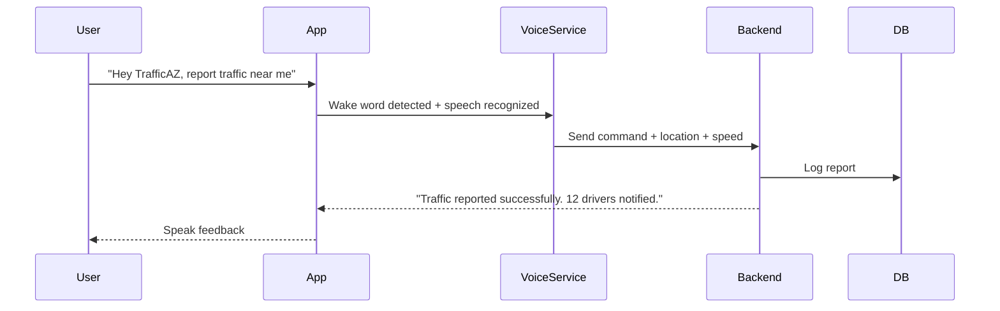

# TrafficAZ

TrafficAZ is an intelligent, voice-activated traffic monitoring and reporting application designed for drivers. It allows users to:

* Receive real-time traffic conditions
* Report traffic congestion using voice commands
* Get spoken traffic alerts and route suggestions
* Use hands-free voice interaction while driving

TrafficAZ uses geolocation, speed metrics, and voice command recognition to provide a seamless and safe driver assistant experience.

---

## Table of Contents

* [Features](#features)
* [Architecture Overview](#architecture-overview)
* [System Diagram](#system-diagram)
* [User Flow](#user-flow)
* [Technologies Used](#technologies-used)
* [Frontend Setup](#frontend-setup)
* [Backend Setup](#backend-setup)
* [API Contract](#api-contract)
* [Voice Commands](#voice-commands)
* [Contributing](#contributing)
* [License](#license)

---

## Features

* Real-time traffic condition monitoring
* Hands-free voice control (wake word: "Hey TrafficAZ")
* Route traffic analysis
* Emergency and congestion reporting
* Speech synthesis and recognition
* Speed tracking and location-aware updates

---

## Architecture Overview

TrafficAZ uses a client-server architecture:

* **Frontend**: Built with React Native + Expo, integrates geolocation, microphone, and text-to-speech APIs
* **Voice Services**: Wake-word detection, intent parsing, voice recognition and feedback
* **Backend**: Python FastAPI for handling API requests, intent parsing, traffic estimation and reporting
* **Database**: Stores user reports, speed/location logs, alerts, and traffic analysis

---

## System Diagram

```mermaid
graph TD
  A[Driver Mobile App] -->|Voice Command| B[Voice Recognition Service]
  B -->|Parsed Command + Location| C[Backend API (FastAPI)]
  C -->|Traffic Data| D[Database]
  C -->|Weather API / ML Models| E[Third-party APIs]
  C -->|Spoken Response| A
  A -->|Location + Speed| C
```

---

## User Flow



---

## Technologies Used

### Frontend

* React Native
* Expo (Location, Speech, Permissions)
* @react-native-voice/voice

### Backend

* Python
* FastAPI
* PostgreSQL (PostGIS)

### APIs

* OpenWeatherMap (optional)
* Geolocation Services

---

## Frontend Setup

```bash
# Install dependencies
yarn install

# Run on Android/iOS
npx expo start
```

Environment:

```env
EXPO_GOOGLE_MAPS_API_KEY=your_key_here
```

---

## Backend Setup

```bash
# Create virtualenv
python -m venv env
source env/bin/activate

# Install dependencies
pip install -r requirements.txt

# Run server
uvicorn main:app --reload
```

---

## API Contract

### POST /api/voice-command

#### Request Body

```json
{
  "userId": "abc123",
  "command": "what's the traffic condition in Melen",
  "latitude": 3.8667,
  "longitude": 11.5167,
  "speed": 27.3,
  "timestamp": "2025-07-06T00:04:14.285Z"
}
```

#### Response

```json
{
  "speechResponse": "Traffic to Melen is heavy. Estimated travel time is 30 minutes."
}
```

---

## Voice Commands

| Command Category | Example Phrases                   | Backend Action                             |
| ---------------- | --------------------------------- | ------------------------------------------ |
| Traffic Query    | "What's traffic like in Melen?"   | Analyze congestion via speed/location data |
| Report Traffic   | "Report traffic here"             | Log report + notify nearby users           |
| Alerts           | "Check my alerts"                 | Fetch stored alerts                        |
| Route Status     | "How's my route to work?"         | Analyze saved route condition              |
| Emergency        | "Accident on the road"            | Broadcast to users/admins                  |
| Weather          | "What's the weather on my route?" | Call weather API & interpret               |

---

## Contributing

We welcome contributions:

* Voice assistant enhancements
* Real traffic dataset integration
* UI/UX improvements
* NLP command parsing

Please submit a pull request or open an issue for discussion.

---

## License

MIT License. See `LICENSE` file for details.

---

> Developed by Glenn Fonchenalla and contributors — 2025.
